# Despliegue de un Sistema con Docker

# Instalación de un moodle y configuración básica para crear un curso y la agregación de usuarios

- Instalación con docker-compose 

### Correr localmente usando docker

1. Clonar el repositorio al directorio local de instalación

    $ git clone https://github.com/orlandoperez18/Despliegue-de-un-Sistema-con-Docker.git

2. Para correr los contenedores

    $ cd Despliegue-de-un-Sistema-con-Docker/

    $ docker compose up

3. Para solucinar los errores, detenemos los contenedores y hacemos unas configuraciones de grupo y de usuarios

    $ sudo chgrp docker mariadb_data/

    $ sudo chown 1001 mariadb_data/

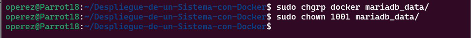

4. Ejecutamos de nuevo el comando

    $ docker compose up

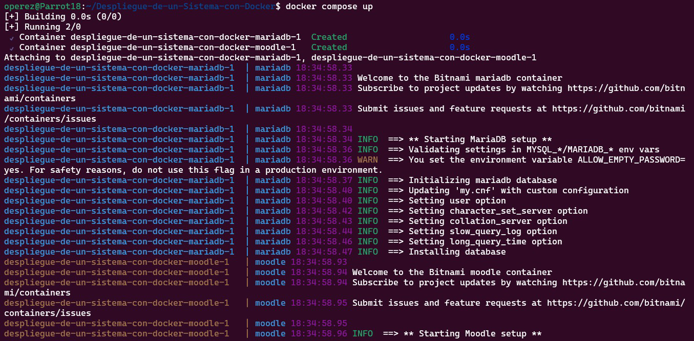

5. Para verificar que los contenedores estan funcionando 

    $ docker ps -a

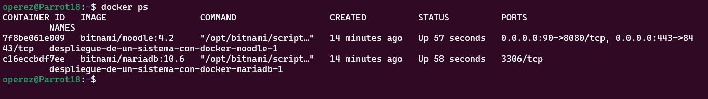

# Paso 1) Correr Moodle y Login del web site

- http://localhost:90/
- Press Log In button

# Paso 2) Login Moodle con Username y Password

Login with 
- Username: user
- Password: bitnani

### Dashboard inicial

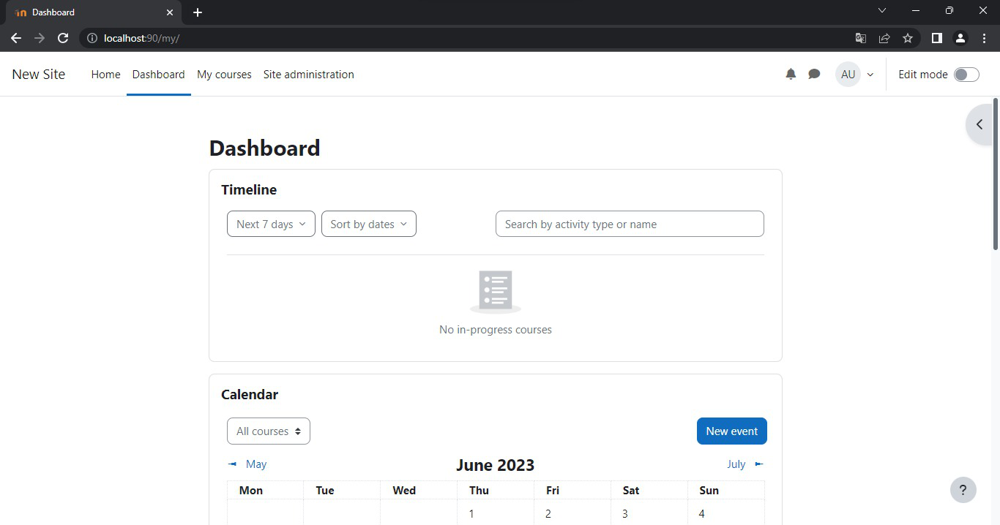

# Paso 3) Creación de un curso

Nos dirigimos a 
- Site administration 
- Courses
- Add a new course

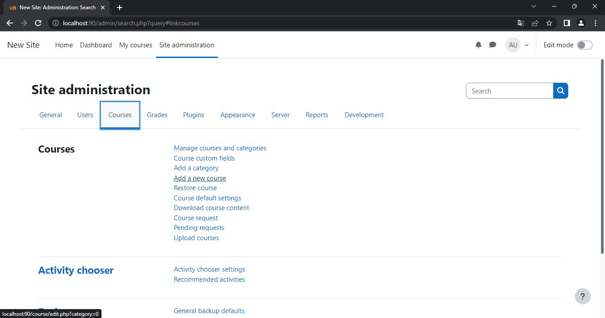

#
### Agreamos los datos que nosotros queremos que tenga el nuevo curso

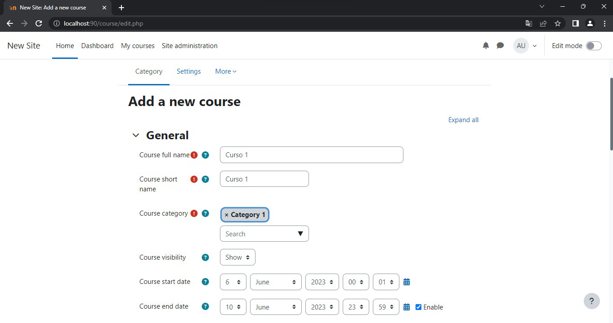
#

### Visualización del nuevo curso ya creado

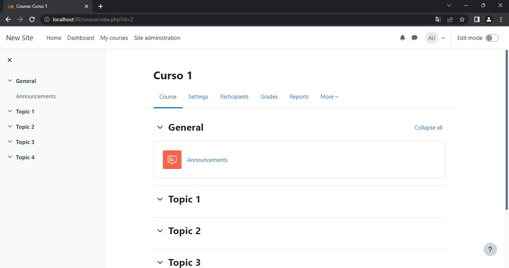
#

# Paso 4) Cambios del perfil de administrador

Para realizar cambios para el administrador nos dirigimos "profile"

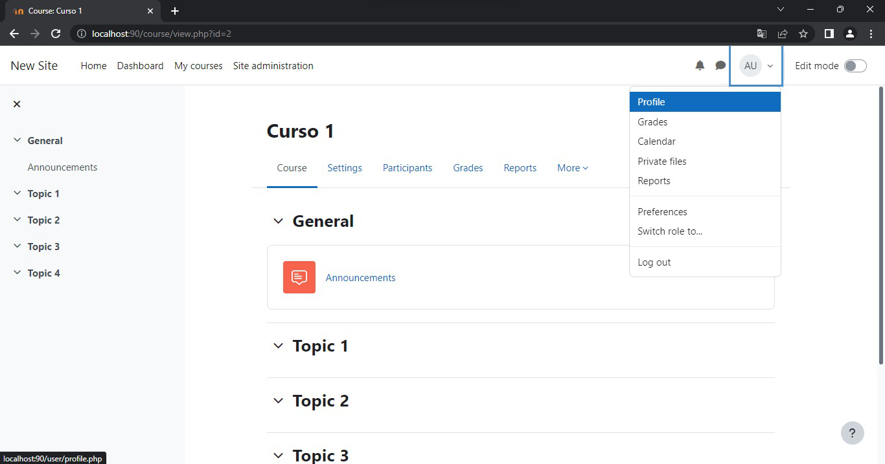
#

Despues de haber entrado en "profile", entramos en "edit profile"

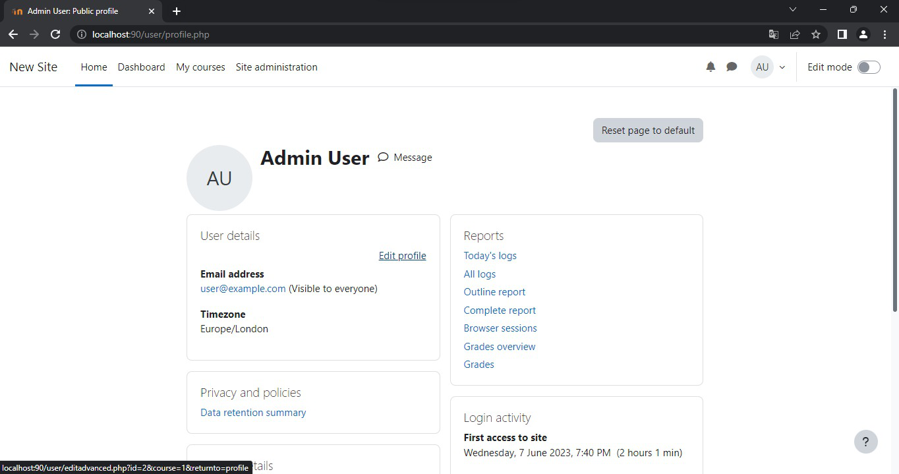
#

Despues de haber entrado en "edit profile", agregamos el nombre, apellido y correo del administrador

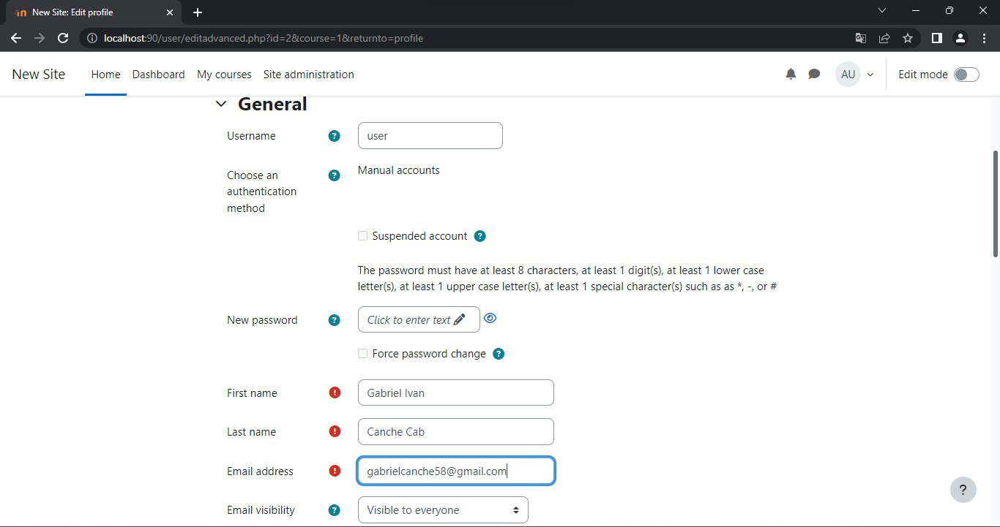
#

Visualización de los cambios realizados a la cuenta del administrador

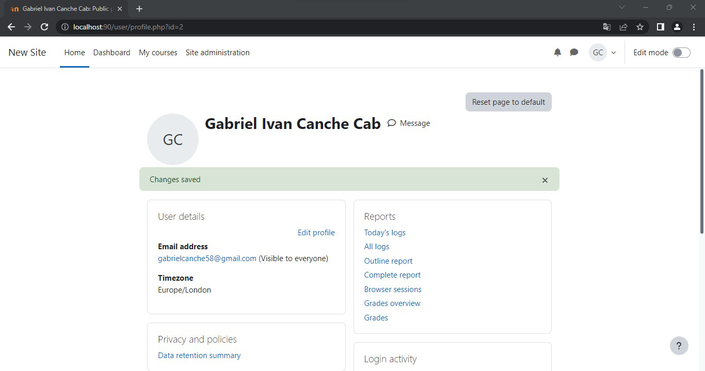
#

# Paso 5) Creamos y agregamos al profesor al curso

Nos dirigimos a 
- Site administration 
- Users
- Add a new user

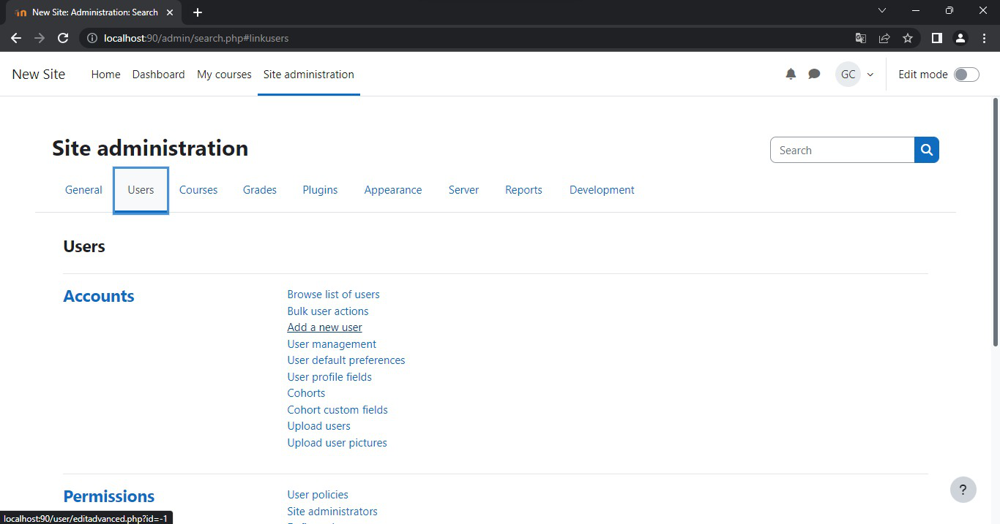
#

### Agreamos los datos del nuevo profesor

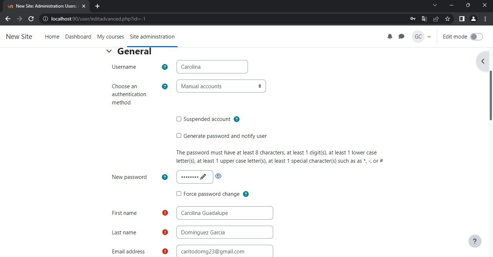
#

Para darle el rol de profesor debemos de entrar a nuestro curso y en el apartado de "participants" le damos click para agregar "Enrol Users"

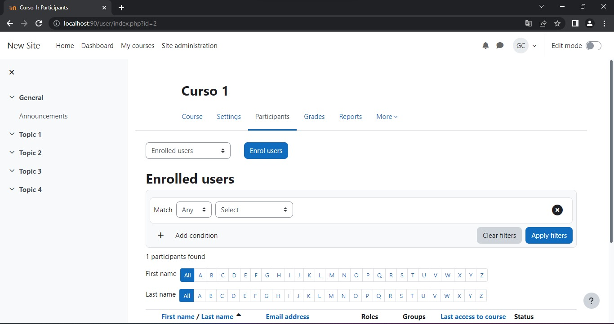
#

Agregamos al usuario y le asignamos el rol de "Teacher"
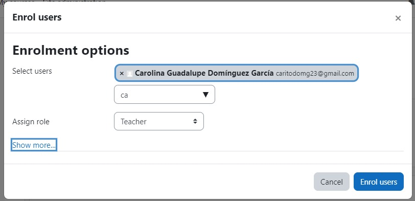
#

# Paso 6) Creamos y agregamos a los estudiantes al curso

Nos dirigimos a 
- Site administration 
- Users
- Add a new user

#

### Agreamos los datos de cada alumno

Datos del primer alunmno
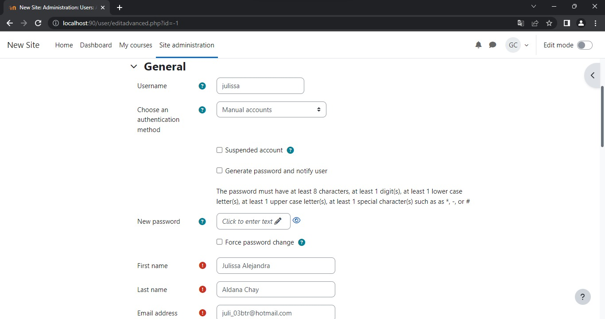
#

Datos del segundo alunmno
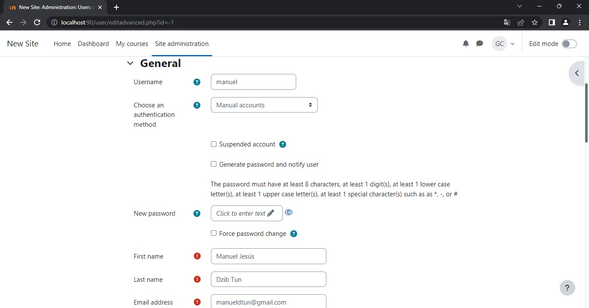
#

Datos del tercer alunmno
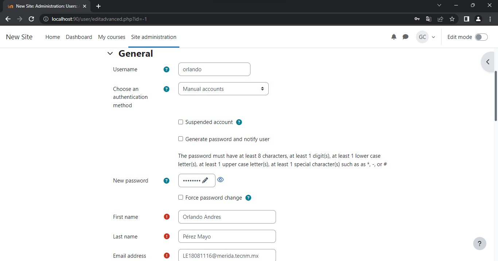
#

Para darle el rol de profesor debemos de entrar a nuestro curso y en el apartado de "participants" le damos click para agregar "Enrol Users"

#

Agregamos a los usuarios y le asignamos el rol de "Students"
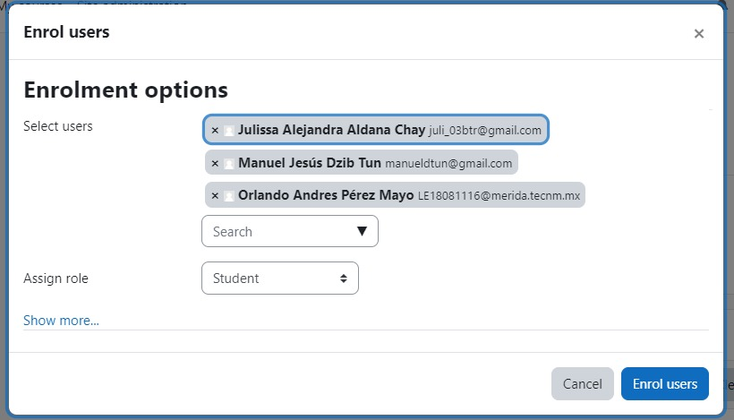
#
